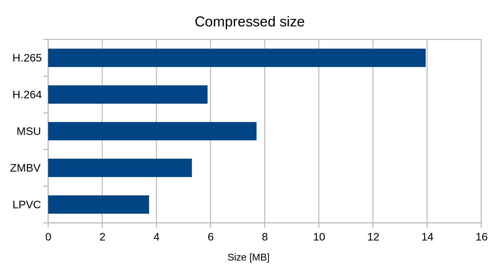
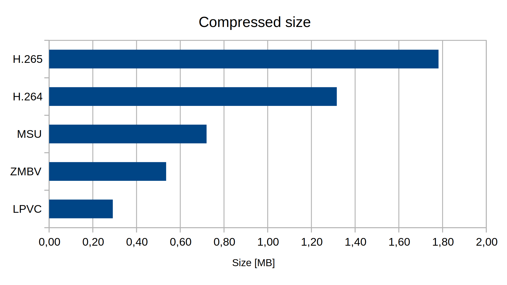

Longplay Video Codec (LPVC) is designed specifically for recording and storing screen capture video from retro video games. In general, it should fare pretty well with any low resolution, low color footage.

# Features

- Support for RGB24 image format
- Lossless compression with Zstandard library
- Dynamic, incremental palette creation for low color frames (up to 8-bit)
- Null frames
- Single color frames
- Video for Windows support
- FFmpeg support (unoffcial)

# Comparison

All video sample files below have the same basic parameters:

- *Resolution:* 384 x 288
- *Color space:* RGB 24-bit
- *Frame rate:* 50 frames per second
- *Length:* 60 seconds (3000 frames)
- *Codec:* LPVC

Transcoding was done with FFmpeg and VirtualDub. All conversions were configured to minimize output size. It is possible that some color space conversions occurred, depending on the codec. This might have skewed some of the benchmarks.

## Video sample #1

Dynamic video, lots of scrolling in all directions.

Download: [video001.avi][video001.avi]

## Video sample #2

Mostly static video, small differences between frames, no scrolling.

Download: [video002.avi][video002.avi]

## Other codecs

Following codecs were intentionally left out of the comparison as they produced results orders of magnitude larger than the rest, obscuring chart data:

- FFV1
- JPEG 2000
- Lagarith Lossless Video Codec

# Warning

This codec should be considered a research project. Do not use it for storing critical data. Do not use it in production environments. In fact, it is best if you don't use it at all, except for your own research and testing. For this reason I release it without license and warranty of any kind. You have been warned.

[video001.avi]: ./docs/video001.avi
[video002.avi]: ./docs/video002.avi
